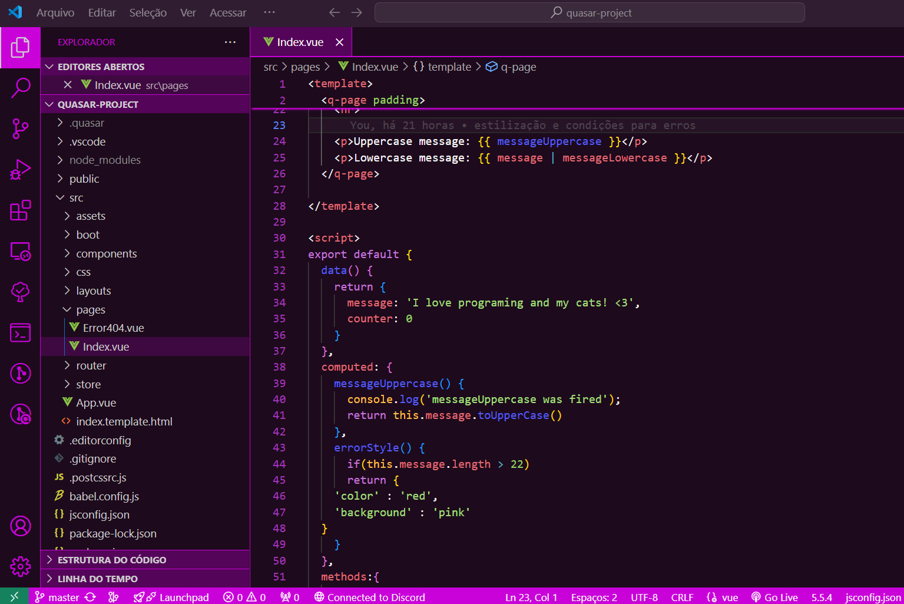
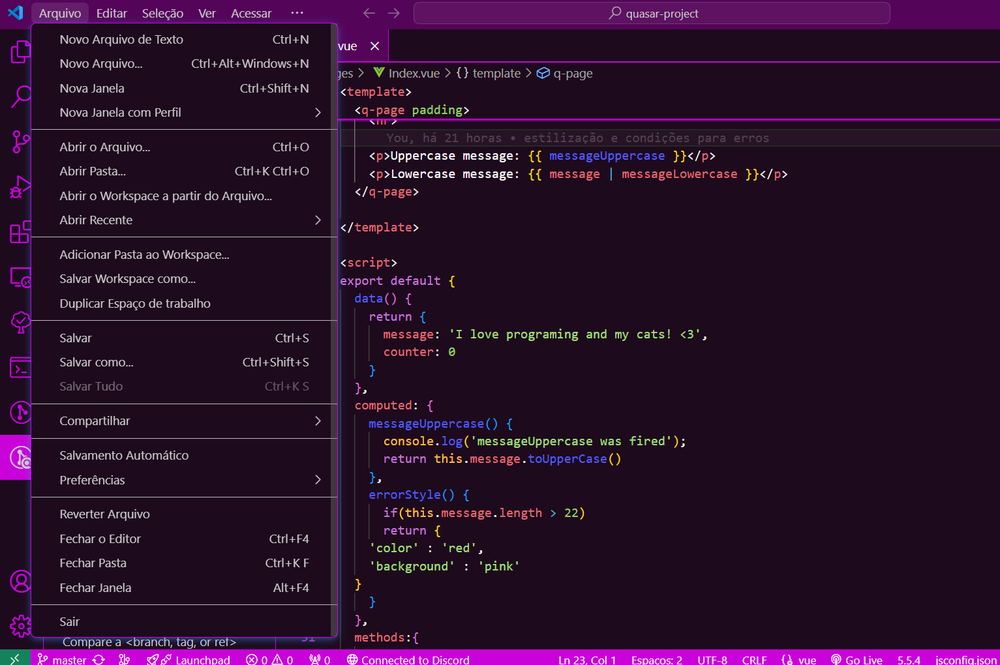
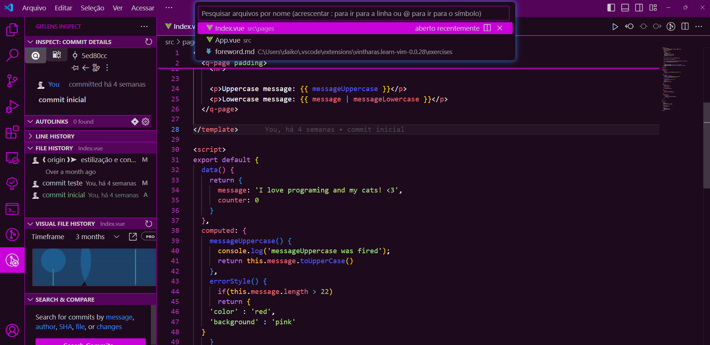

# Lady Luck Pink Color Theme

A pink color theme for VS Code.

## Screenshots

## Installation

1. Open Visual Studio Code.
2. Go to the extensions panel (Ctrl+Shift+X).
3. Search for "Lady Luck Pink Color Theme".
4. Click "Install".

## Usage

After installing, go to `Preferences > Color Theme` and select "Lady Luck Pink".
