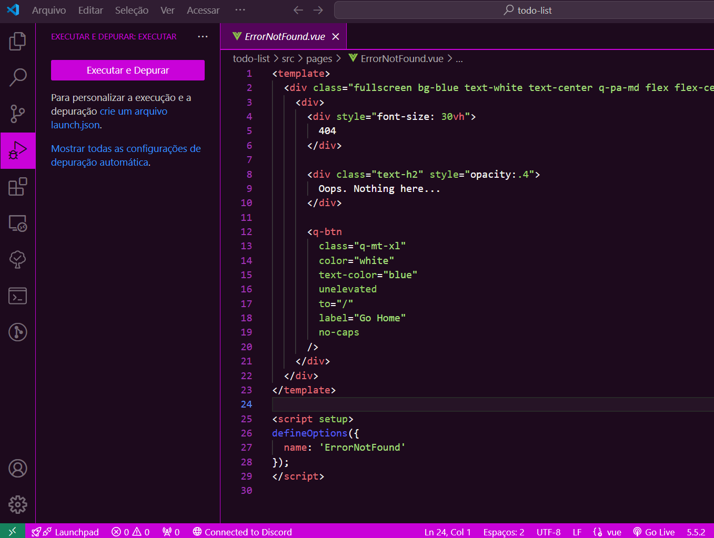

# Lady Luck Pink Color Theme

A pink color theme for VS Code.

## Screenshots

## Instalação

1. Abra o Visual Studio Code.
2. Vá para o painel de extensões (Ctrl+Shift+X).
3. Pesquise por "Lady Luck Pink Color Theme".
4. Clique em "Instalar".

## Uso

Após instalar, vá para `Preferências > Tema de Cor` e selecione "Lady Luck Pink".
